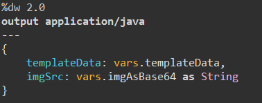
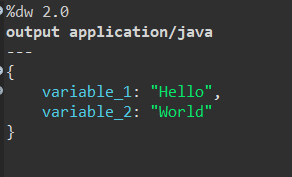
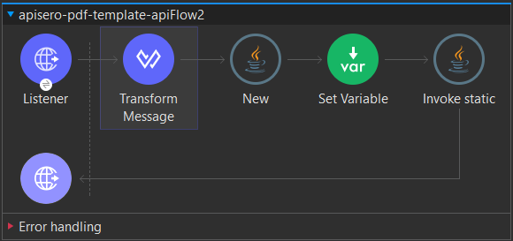
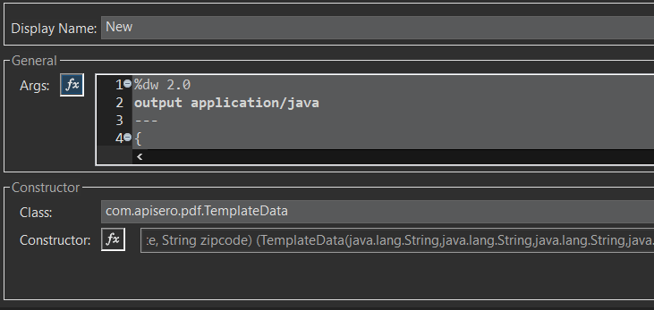
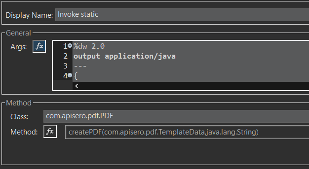

# Creating PDF’s with HTML Templates


# Overview

This tutorial is designed to create a pdf document in a Mulesoft API that is based on an HTML template. This allows you to style your PDF documents with images(logos), CSS, and other properties and features used in HTML. This project uses the following two resources to accomplish this:


## Apache Freemarker

Apache Freemarker is a lightweight engine that gives you a versatile data model rendering an HTML page in Java. [https://freemarker.apache.org/](https://freemarker.apache.org/)


## Open HTML to PDF

Open HTML to PDF is a pure-Java library for rendering a reasonable subset of well-formed XML/XHTML (and even some HTML5) using CSS 2.1 (and later standards) for layout and formatting, outputting to PDF. [https://github.com/danfickle/openhtmltopdf](https://github.com/danfickle/openhtmltopdf)


# Setup


## Dependencies

You’ll need to add the following dependencies to your pom.xml file:

		


```
		<dependency>
			<groupId>org.freemarker</groupId>
			<artifactId>freemarker</artifactId>
			<version>2.3.31</version>
		</dependency>
		<dependency>
			<groupId>com.openhtmltopdf</groupId>
			<artifactId>openhtmltopdf-core</artifactId>
			<version>1.0.10</version>
		</dependency>
		<dependency>
			<groupId>com.openhtmltopdf</groupId>
			<artifactId>openhtmltopdf-pdfbox</artifactId>
			<version>1.0.10</version>
		</dependency>
```


You’ll also need to add the Mulesoft Java module.


## Templates

Templates are stored in a “templates” directory under /src/main/resources.


### Simple template

This is a simple template that uses two string type variables as input:


```
<!DOCTYPE html>
<html>
<body>

<h1>${variable_1}</h1>
<p>${variable_2}</p>

</body>
</html>
```


### Complex template

This is a complex template that uses both a string variable and a Java object as input:


```
<!DOCTYPE html>
<html>
<body>

<p><span></span></p>
<p><span>${templateData.date}</span></p>
<p><span>${templateData.customerName}</span></p>
<p><span>${templateData.streetAddress}</span></p>
<p><span>${templateData.city} ${templateData.state} ${templateData.zipcode}</span></p>

</body>
</html>
```


## Java Classes

This project uses three Java classes. There is a TemplateData class which is just a simple class used to encapsulate data. Second there is the FreeMarkerGenerator class which renders the HTML. And finally the PDF class which contains the static methods invoked by the flows that generate the PDFs from the HTML. These java classes can be viewed from the project repository here: [https://github.com/tkoger/apisero-pdf-template-api/tree/master/src/main/java/com/apisero/pdf](https://github.com/tkoger/apisero-pdf-template-api/tree/master/src/main/java/com/apisero/pdf)


# Flow


## Simple template flow

1. Set the HTTP Listener path to /test1.pdf
2. Set the payload to

3. Using the Java Module’s “Invoke Static” call the PDF Class’s “createPDF” method

4. The static method will return a PDF.


## Complex template flow

1. Set the HTTP Listener path to /test2.pdf
2. Create a new instance of the TemplateData class via the Java Module’s “New”


3. Set a variable called imgAsBase64 with your image data base64 encoded
```
<set-variable value="data:image/png;base64,<put base64 data string here>" doc:name="Set Variable" doc:id="c84ab083-8d07-44bb-a958-ba286ac13d35" variableName="imgAsBase64"/>
```
4. Using the Java Module’s “Invoke Static” call the PDF Class’s “createPDF” method


5. The static method returns the PDF.


# Summary

PDF Generation in Mulesoft API’s is a use-case that can be challenging, especially if the look and feel of the file are of importance. This method will allow you to push custom data into your PDF and allow you to style the document to your needs. The example project code can be found here: [https://github.com/tkoger/apisero-pdf-template-api](https://github.com/tkoger/apisero-pdf-template-api)

